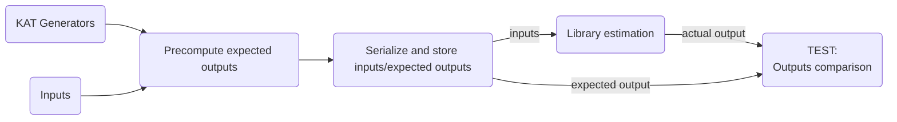

# Tests

## Testing Suite Architecture Overview

This section provides an overview of the testing architecture for our Python
library, which employs two main testing approaches:

- **Known Answer Tests (KATs):** These tests verify the accuracy of the
  estimates made by the CryptographicEstimators library. Here one compares the
  estimates by CryptographicEstimators with the one of existing external
  estimators which are widely accepted as correct by the cryptographic
  community.

- **Doctests:** These tests live within the code's docstrings, serving a dual
  purpose. They illustrate how to use functions and classes through practical
  examples, while simultaneously ensuring the code behaves as documented.

Both KATs and Doctests are powered by the `pytest` framework. Doctests,
specifically, leverage Python's built-in `doctest` module.

## KAT Tests: Understanding the Process

A Known Answer Test (KAT) in cryptography involves comparing the output of an
algorithm implementation against a set of publicly available parameters and
expected values. These expected values serve as reference points for
correctness. This KAT testing framework uses this approach to ensure that any
modifications to the library do not disrupt existing functionality.

Importantly, while pre-calculated parameters and values are common, some
researchers provide source code (estimators) for their estimates, serving as
**KAT generators**. These generators allow for dynamic KAT value generation.

Unlike isolated doctests, KATs take a broader approach by comparing outputs
across entire estimators, often involving complex and computationally intensive
operations. To optimize this process, we serialize expected outputs for specific
predefined inputs. These serialized results streamline subsequent test runs,
enabling efficient comparisons and saving valuable development time.

Here's a breakdown of how our KAT testing process works:



1. **KAT Generator Functions:** We utilize KAT generator functions located in
   the `tests/external_estimators` directory. These functions have hardcoded
   inputs as they are not intended for regular modification. Both input
   parameters and their corresponding outputs (referred to as `expected_outputs`
   as they act as reference values) are serialized into the `tests/kat.yaml`
   file for later use during estimator testing.

2. **Internal Estimation Functions:** With a collection of inputs and their
   expected outputs, we define how these inputs should be processed within our
   library in order to match the configuration of the external estimator. This
   is achieved through internal estimation functions found in the
   `tests/internal_estimators` directory. Each function corresponds to a KAT
   generator in `tests/external_estimators`.

3. **Test Execution and Comparison:** In the final step, we execute all our
   internal estimation functions using the serialized inputs from
   `test/kat.yaml`. The calculated outputs are then compared against the
   expected outputs from the KAT generators to verify the accuracy of the
   CryptographicEstimators library.

This separation of concerns makes it easier to maintain and extend the test
suite as we introduce new estimators or modify existing ones.

### Writing Tests: A Step-by-Step Guide

This guide walks you through incorporating a new KAT test for a library
estimator, offering insights relevant for both understanding and updating
existing tests.

#### 1. Define Your KAT Generator Function

This step involves defining or declaring the KAT generator functions which
produces the expected outputs from hardcoded inputs. These functions are
wrappers of external estimators of the complexity of particular algorithms.
Hence, these functions require careful crafting.

- Begin by creating a new file named `ext_<estimator_name>` within the
  `tests/external_estimators/` directory. This file can be written in either
  Sage or Python, as our framework supports both formats.

- Inside this file, define your KAT generator function using the naming
  convention `ext_<algorithm_name>`. These functions contain the logic to
  calculate expected outputs for their predefined inputs.

For example, consider the `ext_lee_brickell` function:

```python
#Defined at ext_sdfq.py
def ext_lee_brickell():
    """Generate expected complexities for Lee-Brickell SDFq problems.

    This function calculates the expected complexities for a predefined set of
    Lee-Brickell SDFq problem parameters.

    Returns:
        list of tuple: Each tuple contains:
            - tuple: Input parameters (n, k, w, q)
            - float: Corresponding expected complexity
    """

    inputs = [(256, 128, 64, 251), (961, 771, 48, 31)]

    def gen_single_kat(input: tuple):
        n, k, w, q = input
        expected_complexity = ... # output of the external estimating the complexity
        # of the lee-brickell algorithm on inputs (n, k, w, q)
        return input, expected_complexity

    inputs_with_expected_outputs = list(map(gen_single_kat, inputs))
    return inputs_with_expected_outputs
```

- **Important:** Each KAT generator function **must** return a list of tuples,
  with every tuple representing a single KAT (input parameters & expected
  output).

#### 2. Generate reference KAT values

> :warning: **Warning:** This step might take a while as it builds and runs a
> Docker container with SageMath.

- From the library root, run the following Docker command to generate the
  reference KAT values. These are generated based on your KAT generator
  functions and their hardcoded inputs:

  ```bash
  make docker-generate-kat
  ```

- This process creates or updates the `tests/kat.yaml` file, which will now
  include your defined KAT generator functions with their outputs, organized
  within a dictionary. Note that the `ext_` prefix used in the code is removed
  for easier readability in the YAML file.

#### 3. Implement the Internal Estimation Function

In this step, instead of directly writing test functions, we'll define our
library's internal estimators – functions that mirror the KAT generators but
implement our algorithms. These internal estimators are what we rigorously test
against the KAT values.

- Create a new file in the `tests/internal_estimators` directory with a name
  that matches your KAT generator file from step 1, but without the `ext_`
  prefix. For instance, if you created `tests/external_estimators/ext_sdfq.py`,
  your new file would be `tests/internal_estimators/sdfq.py`.

- Within this new file, define a corresponding internal estimation function for
  each KAT generator function from step 1. Use the same function name but remove
  the `ext_` prefix. For example, `ext_lee_brickell` would have a corresponding
  `lee_brickell` function.

- These internal estimation functions **must** adhere to the following
  structure:

  1. **Parameters:**

     - `input`: A tuple containing the input parameters received from the
       serialized KAT data.
     - `epsilon`: A hardcoded value representing the acceptable error tolerance
       during comparison. This helps account for potential small discrepancies
       arising from different calculation methods or precision levels.

  2. **Returns:**

     - `actual_complexity`: The estimated complexity value as calculated by your
       internal estimator or algorithm.
     - `epsilon`: Returns the same `epsilon` value passed as input. This
       practice maintains consistency and makes it clear that error tolerance is
       being considered.

For example, the `lee_brickell` function would look like this:

```python
def lee_brickell(input, epsilon = 0.01):
    """Estimate produced by the CryptographicEstimators library for the Lee-Brickell SDFq problem.

    This function calculates the complexity estimate for a single case of the Lee-Brickell SDFq problem.

    Args:
        input (Tuple[int, int, int, int]): A tuple containing (n, k, w, q) parameters for the SDFq problem.
        epsilon (float): The maximum error tolerance for this estimation.

    Returns:
        Tuple[float, float]: A tuple containing:
            - float: The actual complexity calculated by the LeeBrickell algorithm.
            - float: The epsilon value used for error tolerance.
    """
    n, k, w, q = input  # Unpack input tuple

    actual_complexity =  ...# Calculate the actual complexity using your library's implementation

    return actual_complexity, epsilon  # Return the calculated complexity and the epsilon
```

#### 4. Run Your Tests

With your KAT generator functions, internal estimator implementations, and
generated reference values in place, you're ready to run your tests! Use the
following command from your library's root directory:

```bash
make docker-pytest
```

Or by manually executing
`pytest tests/validations/test_<your_new_estimator>.py`. The output will
indicate whether your internal estimators align with the expected KAT values
within the defined error tolerance.

## Writing Doctests (with sage doctests)

Throughout the CryptographicEstimators library we are using
[sage doctests](https://doc.sagemath.org/html/en/developer/doctesting.html).
These tests are then automatically run by our
[CI](https://github.com/Crypto-TII/CryptographicEstimators/actions) to check for
any errors.

We strongly encourage to write examples for all optimization parameters of an
algorithm. In the case our `DUMMYAlgorithm1` one could extend the optimization
parameter `h` like this:

```python
@optimal_parameter
def h(self):
    """
    MITM parameter of our DUMMYAlgorithm 1

    EXAMPLES::

        sage: from cryptographic_estimators.DummyEstimator.DummyAlgorithms import DUMMYAlgorithm1
        sage: from cryptographic_estimators.DummyEstimator import DUMMYProblem
        sage: A = DUMMYAlgorithm1(DUMMYProblem(n=100))
        sage: A.h()
        50

    """
    return self._get_optimal_parameter("h")
```

Note the newlines around `EXAMPLES::` and in the end. These are mandatory. Also
note the commands the test framework is executing, are starting with `sage: `
and the expected result is written below the last command (`50`).

Additionally, it is mandatory to also test all algorithms at least once in the
corresponding `Estimator` class. E.g. in our case we extend the function
`table()` of the `DUMMYEstimator` to

```python
def table(self, show_quantum_complexity=0, show_tilde_o_time=0,
          show_all_parameters=0, precision=1, truncate=0):
    """
    Print table describing the complexity of each algorithm and its optimal parameters

    INPUT:

    - ``show_quantum_complexity`` -- show quantum time complexity (default: False)
    - ``show_tilde_o_time`` -- show Ō time complexity (default: False)
    - ``show_all_parameters`` -- show all optimization parameters (default: False)
    - ``precision`` -- number of decimal digits output (default: 1)
    - ``truncate`` -- truncate rather than round the output (default: False)

    TESTS:

        sage: from cryptographic_estimators.DummyEstimator import DUMMYEstimator
        sage: A = DUMMYEstimator(n=100)
        sage: A.table()
        +-----------------+----------------------------+
        |                 |          estimate          |
        +-----------------+------+--------+------------+
        | algorithm       | time | memory | parameters |
        +-----------------+------+--------+------------+
        | DUMMYAlgorithm1 | 51.0 |   50.0 | {'h': 50}  |
        +-----------------+------+--------+------------+

        sage: from cryptographic_estimators.DummyEstimator import DUMMYEstimator
        sage: A = DUMMYEstimator(n=1000)
        sage: A.table() # long time
        +-----------------+-----------------------------+
        |                 |           estimate          |
        +-----------------+-------+--------+------------+
        | algorithm       |  time | memory | parameters |
        +-----------------+-------+--------+------------+
        | DUMMYAlgorithm1 | 501.0 |  500.0 | {'h': 500} |
        +-----------------+-------+--------+------------+

    """
    ...
```

Again note the new lines around `TESTS:` and the end of the test. Additionally,
notice the `# long test` at the end of the last command. You can add this if the
command takes a great amount of time, and you do not want to run the test to run
on every change you make, but rather only on every commit. Tests missing the
`# long test` are always executed. Make sure there is at least one example or
test for the table function that executes fast and, hence, is not marked as long
test via `# long time`. This ensures that the `make testfast` command has a good
coverage while still executing in reasonable time which can be very helpful
while integrating code into the library.

If you incorporated an existing estimator to the CryptographicEstimators library
we strongly encourage to load the old estimator as a module into `test/module`
and write unit tests comparing the estimation results of the newly incorporated
estimator against the online available code. An example for such an integration
test can be found under `tests/test_le_bbps.sage`. Its important that all tests
functions start with a `test_`.

To build and run the fast tests, execute:

```sh
make testfast
```

or all tests execute

```sh
make testall
```

#### Pytest

```sh
make docker-pytest
```

### Difference between `_compute_time_complexity(...)` and `time_complexity(...)`

The first one returns the time for a given set of parameters in number of basic
operations, while the second initiates a search for the optimal parameters and
converts time to bit operations if specified, includes memory access costs etc.

## Testing the Frontend

After you finished implementing your estimator, you may want to export it to the
[webfrontend](https://github.com/Crypto-TII/cryptographic_estimators_ui). See
[this](https://github.com/Crypto-TII/cryptographic_estimators_ui/blob/main/docs/INPUTDICTIONARYGUIDE.md)
guide for the details of the configuration possibilities.

The webfrontend is configured via a json file `input_dictionary.json` which is
already contained in this project root directory. This file already contains all
estimators implemented in the CryptographicEstimators framework. To add your new
estimator first run:

```bash
python3 scripts/append_estimator_to_input_dictionary.py
```

This command appends a bare bone configuration to `input_dictionary.json` which
looks like this:

```json
{
  "estimators": [
    {
      "estimator_id": "DUMMYEstimator", // Mandatory (Estimator class name)
      "algorithm_id": "DUMMYAlgorithm", // Mandatory (Algorithm class name)
      "display_label": "Dummy Estimator", // Mandatory
      "landing_page_content": "# Fill with markdown or latex content",
      // Problem parameters are mandatory, they are different for each problem
      // (Syndrome Decoding, Multivariate Quadratic, etc...)
      "problem_parameters": [
        // This is a list of dictionaries. Where each dictionary relates to an specific field on the UI
        {
          "id": "Parameter1", // Mandatory
          "type": "number", // Mandatory
          "display_label": "Parameter 1", // Mandatory
          // All the rest are optional
          "direction": "", // 'row' (default) or 'column'
          "placeholder": "",
          "default_value": "",
          "tooltip": "This is the first problem parameter"
        }
      ],
      "estimator_parameters": [
        {
          "id": "included_algorithms",
          "type": "multiple_selector",
          "direction": "column",
          "display_label": "Included algorithms",
          "tooltip": "Algorithms to include for optimization",
          "default_value": [],
          "excluded_algorithms": [],
          "options": [],
          "dependencies": []
        }
      ], // Equal among all the estimators, same structure as problem_paramenters
      "optional_parameters": [] // Different for each estimator, same structure as problem_paramenters
    }
  ]
}
```

After editing it to your needs it can look like this for the `DummyEstimator`:

```json
{
  "estimators": [
    {
      "estimator_id": "DUMMYEstimator",
      "algorithm_id": "DUMMYAlgorithm",
      "display_label": "Dummy Estimator",
      "landing_page_content": "Dummy Estimator\n\n This project provides an estimator for the well known Dummy Problem on which many cyryptocraphic schemes are based upon.",
      "problem_parameters": [
        {
          "id": "n",
          "type": "number",
          "display_label": "Problem Dimension",
          "placeholder": "Insert parameter",
          "default_value": 100,
          "tooltip": "This is the first problem parameter"
        }
      ],
      "estimator_parameters": [
        {
          "id": "bit_complexities",
          "type": "switch",
          "display_label": "Bit complexities",
          "default_value": true,
          "tooltip": "Show complexities as count of bit operations. If false, show number of elementary operations"
        },
        {
          "id": "memory_access",
          "type": "selector",
          "direction": "column",
          "display_label": "Memory access cost",
          "default_value": 0,
          "tooltip": "Function that takes as input the memory bit complexity and outputs the associate algorithmic cost. Example, logarithmic memory access, input M, output M+log2M.",
          "options": ["Constant", "Logaritmic", "Square root", "Cube root"]
        }
      ],
      "optional_parameters": [] // Different for each estimator, same structure as problem_paramenters
    }
  ]
}
```

Notice that you do not have to specify any algorithm in this configuration file.
As this is all done automatically.
